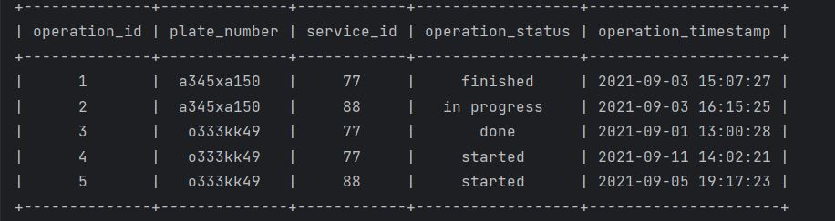

#  An example of working with a local MySQL and Microsoft SQL Server database using Python. 

* MySQL connector - https://www.mysql.com/products/connector/
* pyodbc - https://pypi.org/project/pyodbc/
* tabulate - https://pypi.org/project/tabulate/

## An example of working with displaying data in a table
* Example 1
 

 

* Example 2
 

 
